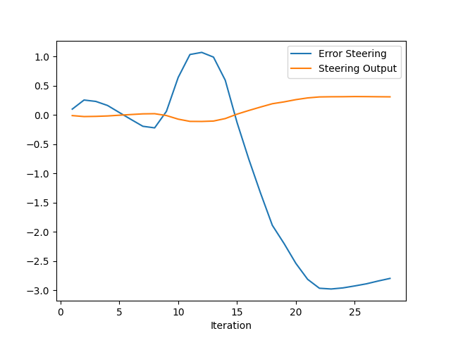
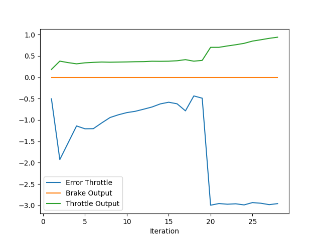

# Report for Control and Trajectory Tracking for Autonomous Vehicle

## Testing Result
* screenshot
  * project/pid_controller/screenshot/screenshot_*.png
  * screenshot_01 : start
  * screenshot_02 : avoid vehicle
  * screenshot_03 : avoid tree
  * screenshot_04 : failed to avoid tree and crash
* log in the terminal
  * [log.md](log.md)
* plot pid result
  * check below image. 
* implement files
  * stored in the current repository.


## Add the plots to your report and explain them (describe what you see)





In the testing, the vehicle avoid a collision with a vehicle on the right side.  
But after that the vehicle went straight forward and don't go back to center line.

* Iteration 0 - 10
   * In this period, PID works fine and steer and throttle are stable.
* Iteration 10 - 15
   * In this time, the vehicle avoid a car on the right side.
   * For this, there are big change at steering but at the throttle there is not big change.
* Iteration around 20
   * The vehicle went straight forward and finally crashed into a tree.
   * In this time, Error Steering and Throttle became bigger.
   * The vehicle continue to move but can't go back to road.
   * The data after 20 iteration show this.
(Check image file and this log data [log.md](log.md)).


##  What is the effect of the PID according to the plots, how each part of the PID affects the control command?

In this program, steering and throttle is determin by TotalError function.  
TotalError function is as followings.
```
    double control = -Kp * p_error - Kd * d_error - Ki * i_error;
    control = max(min(control, output_lim_max), output_lim_min);
```

As this, P, I and D is affected as below.

* P
   * P is based on the error value. So if the error value become bigger, the result is also straightly bigger.
* D
   * D is derivative value for difference of current anad previous error value.  
     If the difference between the two, this value affects to prevent the sharp increase of control value.
* I
   * I is integral value. This value store past data and it seems this helps to prevent the control value become overshoot.  
     But in this case, when vehicle crash into tree, this value affect bad. Vehicle continue to crash into tree with spinning.

## How would you design a way to automatically tune the PID parameters?

I think to use "Twiddle" algorithm is one of the good solution for this.  
To tune several params by hands is difficult and we need to determin params automatically to minimize error.  
Twiddle algorithm seems good to do this.


## PID controller is a model free controller, i.e. it does not use a model of the car. Could you explain the pros and cons of this type of controller?

* Pros
   * We can use this to various type of vehicle which have steer and throttle function.
   * Easy to use at various situation 
* Cons
   * Not taken into consideration of vehicle shape and specification which is depends on the vehicle.
   * In the real world, there are verious parameter like weather, road condition and so on. But this is not taken consideration this. 


## (Optional) What would you do to improve the PID controller?


